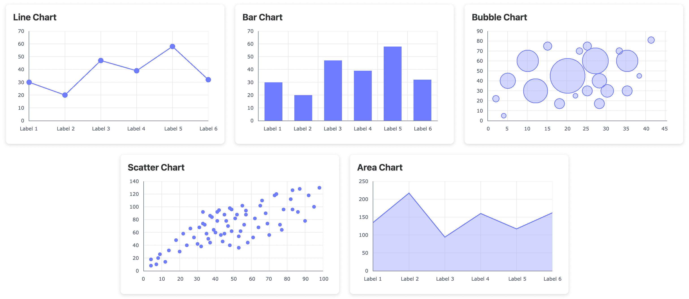

<p align="center">
    
</p>
<h2 align="center">
    Charts Built With a Single DIV
</h2>

<p align="center">
    A frontend engineering experiment that explores how far modern CSS can be pushed to render charts without SVG, Canvas, or image assets.
</p>

<p align="center">
  <a href="https://singledivui.com">Website</a> •
  <a href="https://singledivui.com/demos">Demos</a> •
  <a href="https://singledivui.com/docs">Documentation</a> •
  <a href="https://www.npmjs.com/package/singledivui">npm</a>
</p>

<p align="center">
  <a href="https://www.npmjs.com/package/singledivui" target="_blank">
    
  </a>
  <a href="https://github.com/soundar24/singledivui/blob/master/LICENSE" target="_blank">
    
  </a>
</p>

<!-- --- -->



---

## The Challenge

Some projects start with a requirement.

This one started with a constraint.

> "Innovation often begins by asking: what happens if we do it differently?"

SingleDivUI explores a simple but unconventional idea: building charts using only a single HTML element and modern CSS.

The goal was never to replace existing chart libraries. Rather, it was an opportunity to understand browser rendering capabilities at a deeper level, push CSS beyond its conventional use cases, and uncover new possibilities in UI engineering.

The result is a collection of chart components rendered entirely through CSS and a single root DIV element.

---

## Design Constraints

To make the challenge meaningful, every chart follows a set of intentional constraints:

* Single root DIV element
* No SVG rendering
* No Canvas rendering
* No image-based rendering
* Responsive layouts
* Configurable appearance

These constraints forced the project to explore alternative rendering techniques and pushed CSS far beyond its traditional use cases.


---

## Techniques Explored

SingleDivUI uses combinations of:

* CSS Variables
* Linear Gradients
* Radial Gradients
* Multiple Background Layers
* Pseudo Elements
* CSS Calculations
* Dynamic Positioning
* CSS Transforms
* Responsive Scaling

Many of these techniques are used in unconventional ways to create visualizations that would traditionally be rendered using SVG or Canvas.


---

## The Result

SingleDivUI currently supports:

* Line Chart
* Bar Chart
* Area Chart
* Bubble Chart
* Scatter Chart

The focus is not on competing with mature charting solutions, but on demonstrating what can be achieved when creative constraints are combined with modern CSS capabilities.

---

## Interactive Playground

The project includes an interactive playground for experimenting with chart configuration, customization, and rendering options.


---

## Quick Start

### Installation

```bash
npm install singledivui
```

### Basic Example

```javascript
import { Chart } from 'singledivui';
import 'singledivui/dist/singledivui.min.css';

new Chart('#chart', {
    type: 'line',

    data: {
        labels: ['Jan', 'Feb', 'Mar'],

        series: {
            points: [10, 20, 15]
        }
    }
});
```

---

## Try It Online

### StackBlitz

https://stackblitz.com/edit/singledivui-v1

### CodePen

https://codepen.io/soundar24/pen/zYmGPaz

---

## Documentation

### Getting Started

Learn how to install and create your first chart.

### API Reference

Explore all available chart options and configurations.

### Examples

Browse complete working examples for every chart type.

### Customization Guide

Learn how to customize charts using configuration options.

---

## Architecture Notes

SingleDivUI was built as a frontend engineering experiment rather than a traditional charting solution.

The project explores:

* Constraint-driven design
* Browser rendering behavior
* Advanced CSS composition
* Creative problem solving
* UI rendering without SVG or Canvas

While SVG and Canvas remain the preferred choice for complex charting systems, SingleDivUI demonstrates how far CSS can be pushed when used as a rendering engine.

---

## License

MIT License

See the [LICENSE](./LICENSE) file for details.
